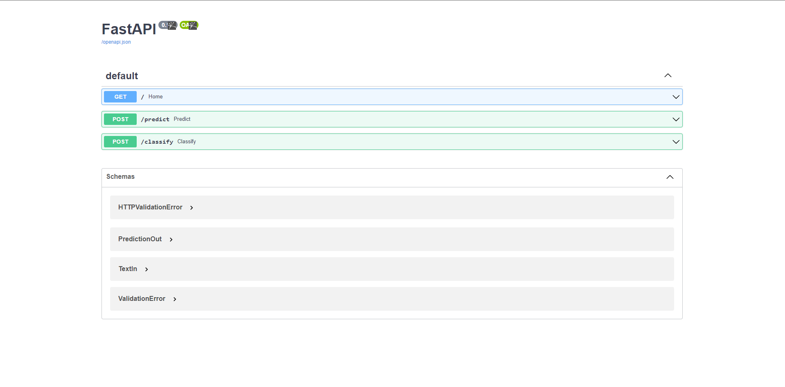
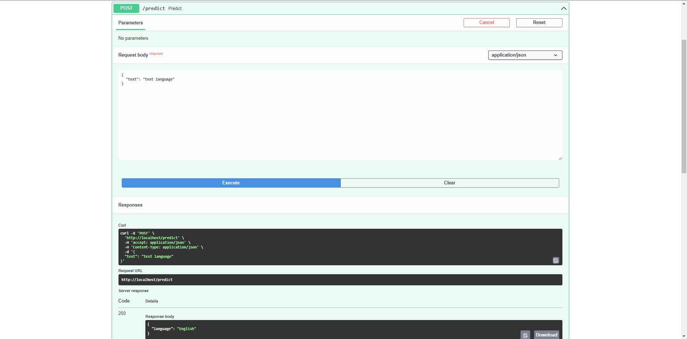

# Text Classification


## Dataset

- Language Detection Dataset ([link](https://www.kaggle.com/datasets/basilb2s/language-detection))
- Text Classification Dataset ([link](https://www.kaggle.com/datasets/kazanova/sentiment140))


## Run Application


```sh
>> cd ./app
>> uvicorn main:app --reload
```

<!-- - The webserver is available at: `http://localhost:80` -->
- The webserver is available at: `http://localhost:8000`  
- Documentation is available at: `http://localhost:8000/docs`


<!-- Build container from Dockerfile:  

```sh
>> docker-compose up --build  # build image and run container
```

Use docker-compose:  

```sh
>> docker-compose up -d    # start container
>> docker-compose down     # stop container
``` -->

Click `Try it out` to try your text value in documentation:  

<p align="left">
    
    
</p>

## Resource

- [Language Detection](https://github.com/AssemblyAI-Examples/ml-fastapi-docker-heroku)
- [Text Classification](https://github.com/patrickloeber/ml-deployment/blob/main/docker-flask/ml-dev/text-classification.ipynb)
- [LSTM text Classification](https://www.kaggle.com/code/arunrk7/nlp-beginner-text-classification-using-lstm)