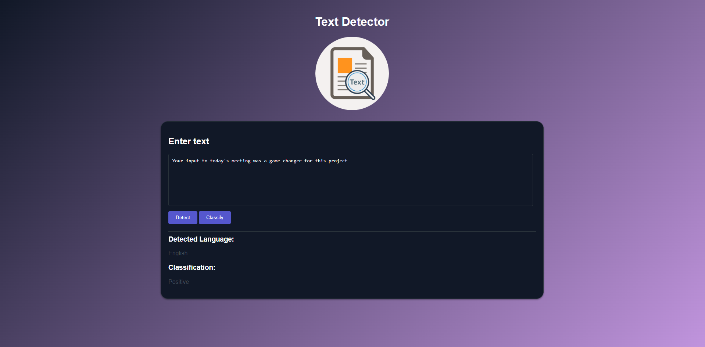

# Text Classification


## Description

This web page provides a user-friendly interface for text detection and classification. Users can enter text, and with the click of a button, the language of the text is detected and displayed. If the language is English, users have the option to classify the text as positive or negative.  

- The __"Detect"__ button is used to trigger the language detection process.
- The __"Classify"__ button is enabled if the language is English; otherwise, it remains disabled.


## Dataset

- [Language Detection Dataset](https://www.kaggle.com/datasets/basilb2s/language-detection)
- [Text Classification Dataset](https://www.kaggle.com/datasets/kazanova/sentiment140)


## Create Docker Container

In /app/main.py, add `app` in both `from app.model import ...`  

- The webserver is available at: `http://localhost:80`
- Documentation is available at: `http://localhost:80/docs`

```sh
>> docker build -t text-classify .      # builde image
>> docker run -p 80:80 text-classify    # run container
```

Use docker-compose:  

```sh
>> docker-compose up --build    # build image and run container
>> docker-compose up -d         # start and run container
>> docker-compose down          # stop and remove container
```

## Run Application

- The webserver is available at: `http://localhost:8000`  
- Documentation is available at: `http://localhost:8000/docs`

```sh
>> cd ./app
>> uvicorn main:app --reload
```


### Webserver UI

The webserver UI is available at: `http://localhost:8000/detect`  

<p align="left">
    
</p>


### Documentation

Click `Try it out` to try custom text value in documentation:  

<p align="left">
    
    
</p>


## Resource

- [Language Detection](https://github.com/AssemblyAI-Examples/ml-fastapi-docker-heroku)
- [Text Classification](https://github.com/patrickloeber/ml-deployment/blob/main/docker-flask/ml-dev/text-classification.ipynb)
- [LSTM text Classification](https://www.kaggle.com/code/arunrk7/nlp-beginner-text-classification-using-lstm)
